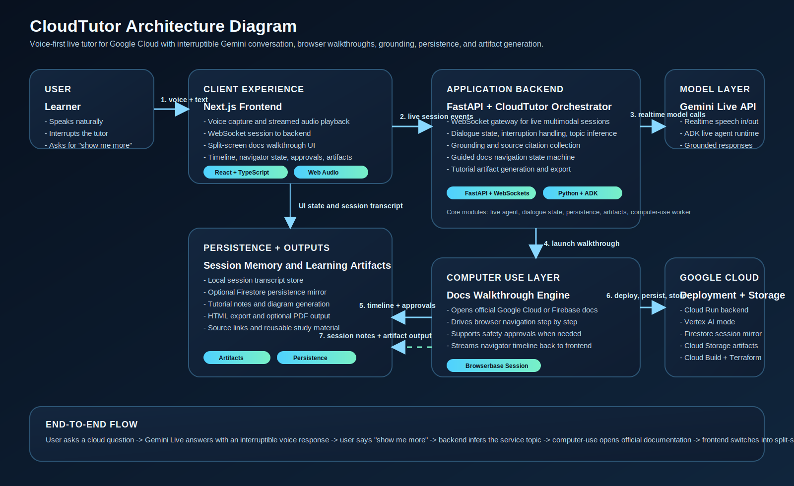

# CloudTutor

CloudTutor is a voice-first AI tutor for Google Cloud. It answers questions in real time, supports interruption like a human tutor, opens official documentation in a guided split-screen walkthrough, and generates reusable tutorial artifacts from each session.

Built for the Gemini Live Agent Challenge.

## What It Does

- Live voice conversation powered by Gemini Live API
- Interruptible tutoring flow with natural barge-in
- Grounded answers with official source links
- Split-screen documentation walkthroughs
- Computer-use navigation with Playwright or Browserbase
- Tutorial artifact generation from the session transcript
- Cloud Run deployment and Terraform infrastructure support

## Architecture Diagram



The diagram shows how the Next.js frontend connects to the FastAPI backend, how the backend orchestrates Gemini Live API through ADK, how computer-use navigation runs through Playwright or Browserbase, and how Cloud Run, Firestore, Cloud Storage, and Vertex AI fit into the system.

## Stack

- Python
- FastAPI
- Google ADK
- Gemini Live API
- Vertex AI or Google AI Studio API key mode
- Next.js
- React
- TypeScript
- Playwright
- Browserbase
- Cloud Run
- Firestore and Cloud Storage integrations

## Repository Layout

- `backend/` FastAPI backend, live agent orchestration, session state, computer-use runtime
- `frontend-next/` primary Next.js frontend used for the live tutor demo
- `frontend/` earlier static frontend shell kept for comparison/testing
- `cloud_tutor_agent/` ADK agent package and local agent env example
- `docs/` demo runbook, rubric mapping, and submission helper docs
- `infra/` Cloud Run runtime config and Terraform files
- `scripts/` local dev, verification, and deployment scripts

## Prerequisites

- Python 3.11+ and `venv`
- Node.js 20+
- npm
- Google Cloud CLI (`gcloud`)
- Firebase CLI if you want to validate Firebase project access

## 1. Python Setup

Create and activate a virtual environment:

```bash
python3 -m venv .venv
source .venv/bin/activate
pip install --upgrade pip
pip install -r backend/requirements.txt
```

Install the Playwright browser once:

```bash
.venv/bin/playwright install chromium
```

## 2. Frontend Setup

Install the Next.js dependencies:

```bash
npm --prefix frontend-next install
```

## 3. Environment Setup

Copy the local environment example:

```bash
cp .env.example .env
```

For manual Next.js frontend runs, you can also create:

```bash
cp frontend-next/.env.local.example frontend-next/.env.local
```

### Minimum local `.env`

For local voice tutoring in AI Studio key mode:

```env
BACKEND_HOST=127.0.0.1
BACKEND_PORT=8080
FRONTEND_NEXT_PORT=4174
NEXT_PUBLIC_BACKEND_URL=http://127.0.0.1:8080

GOOGLE_GENAI_USE_VERTEXAI=0
GOOGLE_API_KEY=PASTE_YOUR_GOOGLE_API_KEY

CLOUDTUTOR_APP_NAME=cloudtutor-backend
CLOUDTUTOR_AGENT_VOICE=Puck
CLOUDTUTOR_AGENT_LANGUAGE=en-US
CLOUDTUTOR_AUDIO_DOWNLINK_MODE=binary
CLOUDTUTOR_COMPUTER_USE_PROVIDER=playwright
CLOUDTUTOR_COMPUTER_USE_MODEL=gemini-2.5-computer-use-preview-10-2025
```

### Browserbase configuration

Browserbase is optional locally, but recommended when you want a hosted browser session:

```env
BROWSERBASE_API_KEY=PASTE_BROWSERBASE_API_KEY
BROWSERBASE_PROJECT_ID=PASTE_BROWSERBASE_PROJECT_ID
CLOUDTUTOR_COMPUTER_USE_PROVIDER=browserbase
```

If Browserbase is not configured, CloudTutor falls back to Playwright.

### Vertex AI configuration

For Cloud Run or Vertex-backed usage:

```env
GOOGLE_GENAI_USE_VERTEXAI=1
GOOGLE_CLOUD_PROJECT=cloudtutor-490215
GOOGLE_CLOUD_LOCATION=us-central1
VERTEXAI_PROJECT=cloudtutor-490215
VERTEXAI_LOCATION=us-central1
```

### Optional persistence and artifact mirrors

```env
CLOUDTUTOR_FIRESTORE_ENABLED=0
FIRESTORE_PROJECT_ID=cloudtutor-490215
CLOUDTUTOR_FIRESTORE_COLLECTION=cloudtutor_sessions

CLOUDTUTOR_ARTIFACT_GCS_BUCKET=cloudtutor-challenge.firebasestorage.app
CLOUDTUTOR_ARTIFACT_GCS_PREFIX=tutorial-artifacts
CLOUDTUTOR_ARTIFACT_GCS_PROJECT=cloudtutor-490215
```

## 4. Run Locally

Recommended local dev mode:

```bash
make dev-next
```

This starts:

- Backend: `http://127.0.0.1:8080`
- Frontend: `http://127.0.0.1:4174`

Open:

```text
http://127.0.0.1:4174
```

### Manual start commands

Backend only:

```bash
make backend
```

Next.js frontend only:

```bash
make frontend-next
```

Legacy static frontend:

```bash
make frontend
```

## 5. Health Checks

Backend health:

```bash
curl http://127.0.0.1:8080/health
```

Computer-use readiness:

```bash
curl http://127.0.0.1:8080/computer-use/health
```

## 6. Verification Commands

Core checks:

```bash
make verify-session01
make verify-session02
make verify-session03
make verify-session04
make verify-session05
make verify-session07
make verify-session08
make verify-session09
make verify-session10
make verify-session11
make verify-session12
make verify-session13
make verify-next
make verify-cloud
```

## Reproducible Testing Instructions

Judges can reproduce the project locally with the steps below.

### Setup

```bash
git clone https://github.com/arizonal2014/cloudtutor_project.git
cd cloudtutor_project
python3 -m venv .venv
source .venv/bin/activate
pip install --upgrade pip
pip install -r backend/requirements.txt
.venv/bin/playwright install chromium
npm --prefix frontend-next install
cp .env.example .env
```

Then add valid credentials to `.env`:

- `GOOGLE_API_KEY` for Gemini Live API in AI Studio mode, or
- Vertex AI settings for Google Cloud mode
- Optional Browserbase credentials if you want hosted browser sessions

### Run the app

```bash
make dev-next
```

Open:

```text
http://127.0.0.1:4174
```

### Quick verification

Backend health:

```bash
curl http://127.0.0.1:8080/health
curl http://127.0.0.1:8080/computer-use/health
```

### Judge-friendly reproducible test flow

Run these commands in order:

```bash
make verify-session01
make verify-session02
make verify-session03
make verify-session04
make verify-session05
make verify-session07
make verify-session08
make verify-session09
make verify-session10
make verify-session11
make verify-session12
make verify-session13
make verify-next
```

If cloud access is configured, judges can also run:

```bash
make verify-cloud
```

### Recommended manual demo test

1. Run `make dev-next`
2. Open `http://127.0.0.1:4174`
3. Ask a question such as `What is Firebase Cloud Functions?`
4. Interrupt the agent with a follow-up question while it is speaking
5. Say `show me more` to trigger the docs walkthrough
6. Confirm the split-screen documentation flow appears
7. Generate a tutorial artifact from the session

## 7. Deploy to Cloud Run

Copy the Cloud Run runtime env template:

```bash
cp infra/env/cloudrun.env.yaml.example infra/env/cloudrun.env.yaml
```

Deploy:

```bash
make deploy-cloud-run
```

Or run the script directly:

```bash
./scripts/deploy_cloud_run.sh --project cloudtutor-490215 --region us-central1
```

## 8. Terraform

If you want infrastructure-as-code deployment:

```bash
cp infra/terraform/terraform.tfvars.example infra/terraform/terraform.tfvars
terraform -chdir=infra/terraform init
terraform -chdir=infra/terraform apply
```

See:

- `infra/terraform/README.md`

## 9. Demo and Submission Docs

- `docs/DEMO_RUNBOOK.md`
- `docs/DEMO_SCRIPT_FIREBASE_CLOUD_FUNCTIONS.md`
- `docs/JUDGE_RUBRIC_MAP.md`

## Notes

- The backend loads environment variables from both the project root `.env` and `cloud_tutor_agent/.env` if present.
- Local computer-use defaults to Playwright unless Browserbase keys are configured.
- The public submission repo intentionally excludes cloned/reference repos and local runtime state.
